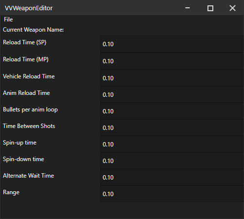

# VWeaponEditor
A live vehicle weapon editor for fire rate, reload speed, etc. Mainly useful for adjusting missile rate of fire e.g. while missiles are active in a deluxo

## How to use
- Open GTA5 single player, use the vehicle spawing menu to spawn in a deluxo, fully upgrade to get missiles then equipt them.
- `File > Open Process...` select GTA5
- The stats should update in the GUI, and when you edit (click field, enter value) or adjust a value (press LMB, move cursor, then release cursor), it is written into the GTA5 memory

When you change vehicles and/or weapons, the GUI will update accordingly.

You can also compile and install the ScriptHookVDotNet script, then in the GUI, click `File > Connect to script`, this will enable the "Current Weapon Name" (since getting name from hash requires calling GTA5 methods, which can only be done from a thread in the process, which is currently via SHVDN. Connection between script and VWeaponEditor is TCP)
